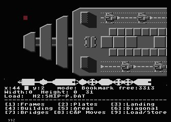

= Ship Editor

:uri-org: https://github.com/the-atari-team
:uri-repo: {uri-org}/tat.oxygene.be
:uri-rel-file-base: link:
:uri-rel-tree-base: link:
ifdef::env-site[]
:uri-rel-file-base: {uri-repo}/blob/master/
:uri-rel-tree-base: {uri-repo}/tree/master/
endif::[]

To create big ships for Oxygene Be, there exists a simple editor.

== start editor

**make editor** in this directory will start the ship editor.
If not, see preparations part in this {uri-rel-file-base}README.adoc[readme]

To start the editor fast, turbo mode of atari800 emulator is used,
to leave the turbo-mode, press F12 first. Now normal Atari 8bit speed is on.

== Editor menu

The editor is mode based. There are 9 different modes, to create different things on the ship.
You can arrive a mode by press digit key most the time. If you do not see the menu, press key 0.

Mode 1-7 are draw different things like

* Frames
* Plates
* Landing Areas
* Buildings
* Areas
* Diagonal things
* Bridges

Mode 8 is for a copy and paste self created areas a.k. bookmarks.

Mode 9 is for load/store ships.

== How this editor works

First, the editor is a really "simple" block-based graphical editor. The upper 17 lines are for the big ships.
The area is 17 lines high and 512 bytes wide.

The lower 7 lines are for the menu. Between the ship and the menu it is possible to show the
whole ship as once in 13 graphics 8 lines. Press '#' key to update the whole display. Please hold in mind
this takes a very long time to draw, so use turbo-mode until it is ready by press F12. Then leave turbo-mode.

Next the red cursor in the upper left corner is your ship cursor.
Move it by cursor keys up and down, left and right. Normally it stays at the 6. left position all the time,
only the big ship is moved. To move fast left and right, use shift key plus cursor up/down.

In the menu the x:... y:... in the left upper shows the cursor position on the ship.

=== If you would like to draw a block.

Choose a draw mode like 'Landebahn' with key 3.

Then the lower menu under the dashes will show which keys are possible now.

Choose key A. A runway occurs at cursor position. Now it can by positioned by use cursor keys.
To really draw it, press space. The cursor will automatically move to the right after the drawn block, so
you can draw the same current block again and again.

You would like to choose another block, press the possible key like J.

You would like to choose another mode, press the digit 1-9.

It is always the same, choose a mode, then what to draw.

Try it, play around.

== Load a ship

Choose key 9 for mode Load/Store

Choose key L for load ship

Currently, it is only possible to load ships with a name `ship-X.dat` from the H2: Device (mounted to /tmp/atari) where X is A-Z, 0-9
use the cursor up/down to choose the right name. There is no directory lister, sorry.
Currently, only the follows ships are there, J, K, L, M, N, O, P, Q, S, T.
To load, press return key.

The editor is error prune, so if a ship can't load, error 170 is shown, but editor will not stop.

If editor stopped by error or reset or break key, you can rerun it. The ship-buffer will not clear.

== store ship

It is equal to load a ship.

== Copy created ships to Oxygene Be game

When you have done your work, store the ship to disk. Maybe SHIP-A.DAT
Leave the editor, take a shell. Change to directory `/tmp/atari` and copy
your ship (SHIP-A.DAT) to the ships' subfolder by removing the dash like
SHIPA.DAT.

Now open the Makefile search for the SHIP*.DAT entries and replace one
which your new one. Maybe complex.

More ease if you simply replace an existing SHIP by
your new version with same name.

Then call **make** and **make start-game** and your new ship should occur in the game.
Maybe you need to manipulate the mission due to fewer jets, open menu.wnf, at line 757
you will find such mission definitions.

You are free to do so.

== copy & paste

Some times you create a nice area and would like to copy it to another place.

Choose a mode C&P Moves by press key 8.

Now move the cursor to the upper left corner of your object.

Press key S. Then press a letter like key A for a bookmark number.

Move the cursor to the lower right corner of your object.

Press key C for a copy, now this object is bookmarks under 'A' and also you can move the cursor with this object to
another place. To put it into the ship, press space. Here the cursor will not move to the right. This must be done
by yourself.

Press ESC. The block has gone, but it is bookmarked. So to get it back,

Choose key 8 again

Press key V (paste) then, press one of the listed bookmarks. Here A, voila, you get the object back.

BUT: Please, due to laziness, no more than 255 characters per bookmark block are possible.

Play around.

To store your bookmarks, Use Mode-9 and load/Store bookmarks.

=== Warning

As long as you are in Mode-8 (C&P) you are also been able to move the whole ship in memory to the left or to the right from
the cursor position. This operation is destructive and irreversible. You should store your ship before.

== Endless ships

Original Ship-Q and Ship-T are marked as "endless" ships, there is no end in the game, if you fly over the right max position
it will beginn at the min left position again.

See this ships how it has been done.

For endless to know, cursor position 4 and 468 are the same to get a smooth crossing.

In Mode-9 there is the switch for the endless mark (key Q)

== Font showing

One point, to show which small 4x8 pixel images are
stored in the font they will
show at cursor x-position 5 to 35.
If you don't need this, remove the 'REM' in line 58 of the source file `ship-editor.lst`.

== To know

* Start a normal not endless ships not earlier than x-position 44, or it will be visible at start without a move.
* Stop x-position before 466, or it will be visible at full stop on right screen end.
* For endless, everything at x-position 2-45 and 466-511 should contain
the same content, or the smooth crossing is visible.

== Bugs

Yes, there are bugs, but hey it is a freeware tool created in my free time.

== Ideas

Maybe, someone creates a font with asteroid forms and a simple runway, so we can build a new game based on this source.

